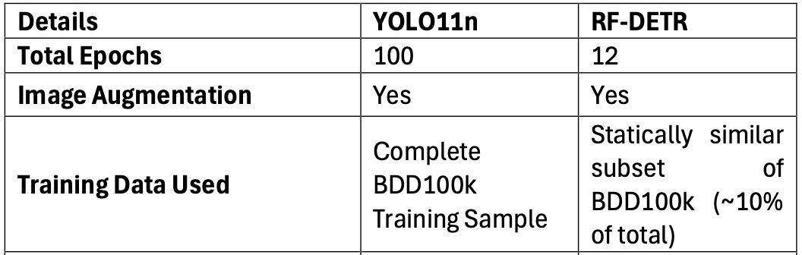
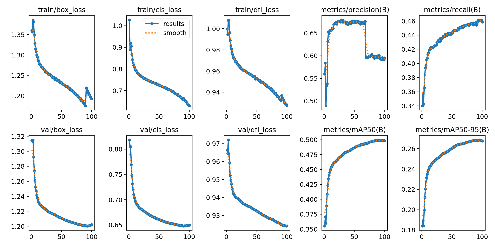
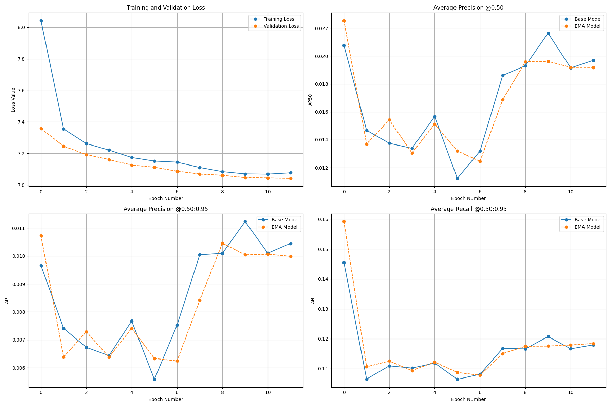
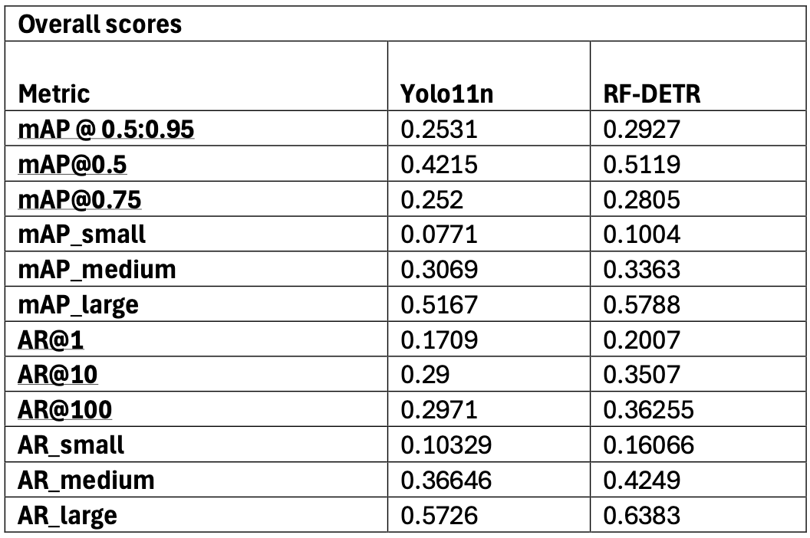

# BDD100K Assignment Submission

<div style="font-size: 16px; background-color: #FFEB3B; color: #000; padding: 12px; border-radius: 4px; margin-bottom: 20px; border-left: 5px solid #F57F17;">
<strong>⚠️ CRITICAL INSTRUCTION:</strong> Please ensure you go through all three reports (Task-1, Task-2, and Task-3). They contain the most important analysis, findings, and explanations required as per the assignment tasks.
<ul style="margin-top: 10px; margin-bottom: 0;">
  <li><a href="Task-1-report.pdf">Task-1-report.pdf</a></li>
  <li><a href="Task-2-report.pdf">Task-2-report.pdf</a></li>
  <li><a href="Task-3-report.pdf">Task-3-report.pdf</a></li>
  <li>A copy of the Dashboard (contains plots, outliers, anomalies, etc.) as PDF: <a href="EDA Dashboard.pdf">EDA Dashboard.pdf</a></li>
  <li>Generated output from each task (Easy access). Link: <a href="https://drive.google.com/drive/folders/1CVtsUzLZOH4GUV6NxF-ss4wvhkqe20dD?usp=sharing">Google Drive</a></li>
</ul>
</div>

---

A comprehensive computer vision pipeline for object detection on the BDD100K dataset, featuring exploratory data analysis (EDA), model training, and evaluation for two detectors: YOLO11n and RF-DETR.

## Table of Contents
- [Prerequisites](#prerequisites)
- [Task 1: Exploratory Data Analysis (EDA)](#task-1-exploratory-data-analysis-eda)
- [Task 2: Model Training](#task-2-model-training)
- [Task 3: Model Evaluation](#task-3-model-evaluation)
- [Important Note](#important-note)

## Prerequisites
- Python 3.8+
- pip or conda package manager

**Note:** Each task has its own setup requirements. See the setup section under each task below.

<div style="font-size: 16px; background-color: #E3F2FD; color: #000; padding: 12px; border-radius: 4px; margin-bottom: 20px; border-left: 5px solid #2196F3;">
<strong>ℹ️ DATASET SETUP:</strong> Before starting, you must ensure the dataset is present in the following folders:
<ol style="margin-top: 8px; margin-bottom: 8px;">
  <li><code>assignment_data_bdd/</code></li>
  <li><code>coco_format_full/</code></li>
  <li><code>training_scripts/bdd100k_subset/</code></li>
</ol>
Please refer to the <code>instructions.txt</code> file located inside each of these folders to download and extract the respective data.
</div>


## Task 1: Exploratory Data Analysis (EDA)

<div style="font-size: 16px; background-color: #FFEB3B; color: #000; padding: 8px; border-radius: 4px; margin-bottom: 15px;"><strong>⚠️ INSTRUCTIONS:</strong> View dashboard.html side by side with Task-1-Report.pdf for a comprehensive analysis overview.</div>

### Container Setup and Getting the Live Dashboard

Pull and run the pre-built Docker image to explore the EDA dashboard without any local setup.

```bash
# Step 1: Pull the Docker image
docker pull rohit01021998/bdd100k-eda:latest

# Step 2: Run the container (use your image ID if the tag doesn't resolve)
docker run -it -p 8000:8000 rohit01021998/bdd100k-eda:latest bash

# Step 3: Navigate to the data directory
cd /container_data

# Step 4: Run the EDA pipeline
python3 -m eda_pipeline.main

# Step 5: Switch to the output directory (dashboard.html will be generated here)
cd /eda_pipeline_output

# Step 6: Start a simple HTTP server
python3 -m http.server 8000
```

Once the server is running, open the following URL in your **host** browser:

```
http://localhost:8000/dashboard.html
```

### Local Setup (Non-Containerized)

### Setup
```bash
pip install -r requirement.txt
```

### Running EDA

Run the EDA pipeline to analyze the BDD100K dataset:

```bash
python -m eda_pipeline.main
```

This will:
- Analyze dataset statistics and distributions
- Generate visualizations
- Identify data patterns and anomalies
- Create a comprehensive EDA dashboard

**Output:** Analysis reports and visualizations in the `eda_pipeline_output/` directory.

**Directory structure of the output folder:**

```text
eda_pipeline_output/
├── plots/
│   └── per_class/
├── edge_cases/
└── dashboard.html
```

<span style="background-color: #FFEB3B; color: #000; padding: 2px 4px; border-radius: 3px;">**Instructions:** View `dashboard.html` side by side with `Task-1-Report.pdf` for a comprehensive analysis overview.</span>

<div style="font-size: 16px; background-color: #E0F2F1; color: #000; padding: 12px; border-radius: 4px; margin-bottom: 20px; border-left: 5px solid #009688;">
<strong>📝 NOTE:</strong> A copy of the dashboard is also available as a PDF for backup purposes: <code>EDA Dashboard.pdf</code>.
</div>
---

## Task 2: Model Training

<div style="font-size: 16px; background-color: #FFEB3B; color: #000; padding: 8px; border-radius: 4px; margin-bottom: 15px;"><strong>⚠️ INSTRUCTIONS:</strong> View Task-2-report.pdf, output and description is captured in it</div>

### Setup
```bash
cd training_scripts
pip install -r requirements-training-rfdetr.txt
```

**Note:** 
- YOLO11n was trained in Kaggle's default environment
- RF-DETR was trained on Jetson Thor

### Training Models

Two object detection models were trained on the BDD100K dataset:



#### YOLO11n Training
*Trained in Kaggle's default environment*

```bash
python yolo-11n-train-bdd100k.ipynb
```



#### RF-DETR Training
*Trained on Jetson Thor*

```bash
python rf-detr-finetuning-v2-lr-ms.py
python finish_evaluation.py
```

**Note:** Jetson Thor has its own requirements file as it's an ARM-based system and the training script for RF-DETR may not work on x86-based systems. For convenience, pretrained weights have been provided here (both are needed):
- `rf-detr-medium.pth` - Base RF-DETR model
- `rf_detr_medium_thor_3x_ms_final.pth` - Fine-tuned RF-DETR model



Once the model was trained, the weights were kept in the main folder so that Task-3 scripts could utilize them. For your convenience, this has been set up beforehand.

Training details, plots, architecture details, etc. are present in Task-2-Report.pdf.

**Output:** Trained model weights and other analysis will be saved in `training_scripts/rf_detr_output/`

---

## Task 3: Model Evaluation

<div style="font-size: 16px; background-color: #FFEB3B; color: #000; padding: 8px; border-radius: 4px; margin-bottom: 15px;"><strong>⚠️ INSTRUCTIONS:</strong> View Task-3-report.pdf for detailed analysis and execution of the task</div>

### Setup
```bash
pip install -r requirement.txt # same as Task-1
```

### Evaluating Models

Evaluate both trained models using their respective evaluation pipelines.

### YOLO11n Evaluation

```bash
# Step 1: Run inference (generates predictions JSON)
python -m yolo11n_eval.inference

# Step 2: Generate all plots & metrics
python -m yolo11n_eval.evaluation

# Step 3: Load data into FiftyOne (only needed once)
python -m yolo11n_eval.voxel51_eval
python -m yolo11n_eval.add_scene_metadata

# Step 4: Launch FiftyOne browser app (reusable anytime after step 2)
python -m yolo11n_eval.fo_launch
```

### RF-DETR Evaluation

```bash
# Step 1: Run inference (generates predictions JSON)
python -m rf_detr_eval.inference

# Step 2: Generate all plots & metrics
python -m rf_detr_eval.evaluation

# Step 3: Load data into FiftyOne (only needed once)
python -m rf_detr_eval.voxel51_eval
python -m rf_detr_eval.add_scene_metadata

# Step 4: Launch FiftyOne browser app (reusable anytime after step 2)
python -m rf_detr_eval.fo_launch
```


**Output:**
- Prediction JSON files (`yolo11n_val_predictions.json`, `rf_detr_val_predictions.json`)
- Performance metrics and visualizations
- FiftyOne dataset for interactive exploration

<div style="font-size: 16px; background-color: #E8EAF6; color: #000; padding: 12px; border-radius: 4px; margin-bottom: 20px; border-left: 5px solid #3F51B5;">
<strong>🔍 Qualitative Analysis with FiftyOne:</strong> The validation dataset was queried within the FiftyOne UI to isolate model failure points:
<ul style="margin-top: 8px; margin-bottom: 0;">
  <li><strong>False Negative Filtering:</strong> A filter was applied to the ground-truth (GT) labels to identify "extreme" failures where the model missed 10 to 15+ objects in a single image.</li>
  <li><strong>Cluster Isolation:</strong> These highly problematic scenes were isolated into a dedicated cluster.</li>
  <li><strong>Observation Extraction:</strong> The cluster was manually reviewed to identify root causes, such as object misclassifications, occlusion, and challenging environmental factors.</li>
</ul>
</div>

Please refer to Task-3-Report.pdf to see a benchmark comparison of trained models, their benchmarking, and FiftyOne (voxel51) based analysis and insights.

---


## Important Note
If you are unable to run the repository/scripts locally, please refer to the link below which contains the output folders of the script executions.

[Google Drive Output Folder Link](https://drive.google.com/drive/folders/1CVtsUzLZOH4GUV6NxF-ss4wvhkqe20dD?usp=sharing)